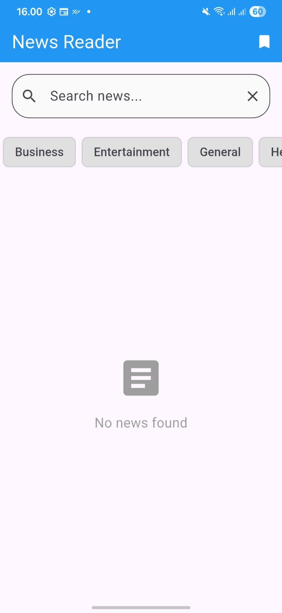

# 📰 News Reader App

## 📌 Deskripsi Proyek
**News Reader App** adalah aplikasi mobile berbasis **Flutter** yang digunakan untuk membaca berita terkini dari berbagai sumber terpercaya. Aplikasi ini memungkinkan pengguna untuk melihat berita utama, mencari berita berdasarkan kata kunci, memilih kategori berita, serta menyimpan berita favorit ke dalam bookmark.

Aplikasi ini dibangun sebagai tugas proyek dengan tujuan untuk memahami konsep **REST API**, **state management menggunakan Provider**, serta penerapan **arsitektur aplikasi yang bersih dan terstruktur**. Sumber data berita pada aplikasi ini berasal dari **NewsAPI (https://newsapi.org)**.

---

## ✨ Fitur-fitur
- 📢 Menampilkan berita utama (Top Headlines)
- 🔍 Pencarian berita berdasarkan kata kunci
- 🗂️ Filter berita berdasarkan kategori
- ⭐ Menyimpan berita ke dalam bookmark
- 🔄 Refresh berita (pull to refresh)
- ⚠️ Penanganan error dan loading state
- 📱 Tampilan antarmuka sederhana dan responsif

---

## ⚙️ Instalasi dan Setup

### Prasyarat
Pastikan perangkat kamu sudah memenuhi syarat berikut:
- **Flutter SDK** versi terbaru
- **IDE**:  
  - Visual Studio Code atau  
  - Android Studio
- Emulator Android atau perangkat fisik

### Langkah-langkah Instalasi
1. Clone repository proyek:
   ```bash
   git clone [url-repo-anda]
2. Masuk ke directory proyek:
   ```bash
   cd news_reader
3. Install seluruh dependencies:
   ```bash
   flutter pub get
4. Konfigurasi API Key (opsional)
    Masukkan API Key NewsAPI ke file: lib/core/constants/api_constants.dart
5. Jalankan Applikasi
   ```bash
   flutter run

---

## 📸 Screenshots
Berikut adalah beberapa tampilan utama dari aplikasi News Reader:



---

## 🗂️ Struktur Folder

lib/
├── main.dart
├── core/               # Konstanta dan Exceptions applikasi
│   ├── constants/
│   └── exceptions/
├── data/               # Pengambilan dan pemodelan data dari API
│   ├── datasources/
│   └── models/
├── domain/             # Repository sebagai penghubung data dan UI
│   └── repositories/
├── presentation/       # UI, Provider, dan widget aplikasi
│   ├── providers/
│   ├── screens/
│   └── widgets/

---

## 🤝 Panduan Kontribusi (Contribution Guidelines)
1. Fork Repository ini https://github.com/fadhlurthoriq/news-reader
2. Buat branch baru:
   ```bash
   git checkout -b fitur-baru
3. Lakukan perubahan dan commit:
   ```bash
   git commit -m "Menambahkan fitur baru"
4. Push ke repository:
   ```bash
   git push origin fitur-baru
5. Buat pull request